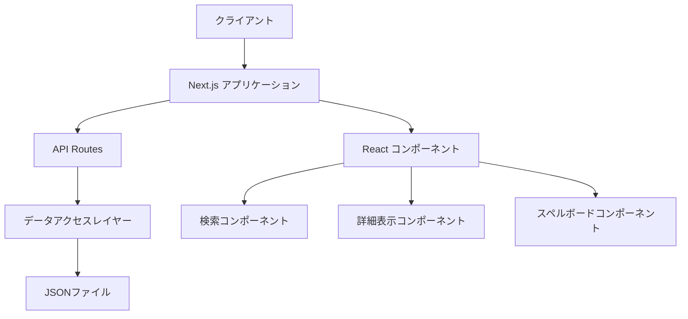

# 設計ドキュメント

## 概要

スペルトナエルの呪文検索サイトは、ユーザーが効率的に呪文を検索し、詳細情報を閲覧できるWebアプリケーションです。このアプリケーションはNext.jsを使用して構築され、インクリメンタル検索機能、詳細表示、スペルボード表示などの機能を提供します。本設計ドキュメントでは、アプリケーションのアーキテクチャ、コンポーネント構造、データモデル、およびユーザーインターフェースについて詳細に説明します。

## アーキテクチャ

### 全体構成

アプリケーションはNext.jsフレームワークを使用し、以下の主要コンポーネントで構成されます：



### 技術スタック

- **フロントエンド**: React, Next.js, TypeScript
- **スタイリング**: TailwindCSS
- **状態管理**: React Context API
- **データ保存**: JSONファイル
- **ビルドツール**: Next.js ビルドシステム
- **デプロイ**: Vercel（推奨）

## コンポーネントと機能

### 1. コアコンポーネント

#### 1.1 アプリケーションレイアウト

- ヘッダー、フッター、メインコンテンツエリアを含む基本レイアウト
- レスポンシブデザインの実装
- ナビゲーション要素

#### 1.2 検索コンポーネント

- 検索ボックス
- リアルタイム検索結果表示
- カテゴリフィルター
- 検索結果のソート機能

#### 1.3 詳細表示コンポーネント

- 呪文の詳細情報表示
- 関連呪文へのリンク
- スペルボードとの連携表示

#### 1.4 スペルボードコンポーネント

- 8x8のグリッド表示
- 行選択機能
- ハイライト表示機能
- 検索結果との連携

### 2. インターフェース定義

#### 2.1 検索コンポーネントインターフェース

```typescript
interface SearchProps {
  onSearch: (query: string) => void;
  categories: string[];
  onCategorySelect: (category: string) => void;
  selectedCategories: string[];
}

interface SearchResultProps {
  results: SpellData[];
  onSpellSelect: (spell: SpellData) => void;
  isLoading: boolean;
}
```

#### 2.2 詳細表示コンポーネントインターフェース

```typescript
interface SpellDetailProps {
  spell: SpellData | null;
  onBack: () => void;
  relatedSpells: SpellData[];
}
```

#### 2.3 スペルボードコンポーネントインターフェース

```typescript
interface SpellBoardProps {
  selectedSpell: SpellData | null;
  onRowSelect: (row: number) => void;
  highlightedRows: number[];
}

interface BoardCellProps {
  content: string;
  isHighlighted: boolean;
  row: number;
  column: number;
}
```

## データモデル

### 1. スペルデータモデル

```typescript
interface SpellData {
  id: string;
  名前: string;
  必要な歌の段: string;
  唱える段の順番: string;
  カテゴリ: string;
  説明?: string;
}

interface SpellCategory {
  id: string;
  name: string;
  description?: string;
}
```

### 2. 検索クエリモデル

```typescript
interface SearchQuery {
  text: string;
  categories: string[];
  sortBy?: 'name' | 'category' | 'complexity';
  sortDirection?: 'asc' | 'desc';
}
```

### 3. アプリケーション状態モデル

```typescript
interface AppState {
  spells: SpellData[];
  filteredSpells: SpellData[];
  selectedSpell: SpellData | null;
  searchQuery: SearchQuery;
  isLoading: boolean;
  error: string | null;
  highlightedRows: number[];
}
```

## API設計

### 1. スペル取得API

- **エンドポイント**: `/api/spells`
- **メソッド**: GET
- **クエリパラメータ**:
  - `q`: 検索クエリ文字列
  - `categories`: カンマ区切りのカテゴリリスト
  - `sortBy`: ソート基準
  - `sortDirection`: ソート方向
- **レスポンス**: スペルデータの配列

### 2. 個別スペル取得API

- **エンドポイント**: `/api/spells/[id]`
- **メソッド**: GET
- **パスパラメータ**:
  - `id`: スペルID
- **レスポンス**: 単一のスペルデータオブジェクト

## 検索アルゴリズム

### 1. テキスト検索

1. 入力された検索クエリを正規化（小文字化、空白除去）
2. 以下の条件でスペルをフィルタリング:
   - 呪文名に検索クエリが含まれる
   - 必要な歌の段に検索クエリが含まれる
   - 唱える段の順番に検索クエリが含まれる
3. ひらがな入力の場合はカタカナに変換して検索
4. 検索結果をスコアリングして関連度順にソート

### 2. カテゴリフィルタリング

1. 選択されたカテゴリに基づいてスペルをフィルタリング
2. 複数カテゴリが選択された場合はOR条件で結合
3. テキスト検索と組み合わせて最終結果を生成

## エラーハンドリング

### 1. クライアントサイドエラー

- 検索クエリのバリデーションエラー
- データ取得中のネットワークエラー
- コンポーネントレンダリングエラー

### 2. サーバーサイドエラー

- JSONファイル読み込みエラー
- API処理エラー
- データ形式エラー

### 3. エラー表示方法

- ユーザーフレンドリーなエラーメッセージ
- エラーログ記録
- 自動リトライ機能（必要に応じて）

## テスト戦略

### 1. ユニットテスト

- 各コンポーネントの機能テスト
- ユーティリティ関数のテスト
- データ変換ロジックのテスト

### 2. 統合テスト

- コンポーネント間の連携テスト
- API呼び出しとデータ表示の統合テスト
- 検索フローの全体テスト

### 3. パフォーマンステスト

- 大量データでの検索パフォーマンス
- レンダリングパフォーマンス
- メモリ使用量の監視

## UI/UXデザイン

### 1. レイアウト構成

```
+----------------------------------+
|           ヘッダー               |
+----------------------------------+
|  検索ボックス                    |
+----------------------------------+
|  カテゴリフィルター              |
+----------------------------------+
|                |                 |
|  検索結果リスト |  スペルボード   |
|                |                 |
|                |                 |
+----------------------------------+
|           詳細表示               |
+----------------------------------+
|           フッター               |
+----------------------------------+
```

### 2. モバイルレイアウト

```
+----------------------------------+
|           ヘッダー               |
+----------------------------------+
|  検索ボックス                    |
+----------------------------------+
|  カテゴリフィルター              |
+----------------------------------+
|  検索結果リスト                  |
|                                  |
|                                  |
+----------------------------------+
|  スペルボード（タップで展開）     |
+----------------------------------+
|  詳細表示（選択時に表示）        |
+----------------------------------+
|           フッター               |
+----------------------------------+
```

### 3. カラースキーム

- 基本色: #f8f9fa（背景）、#212529（テキスト）
- アクセント色: #4361ee（リンク、ボタン）
- 警告色: #e63946（エラー）
- 成功色: #2a9d8f（成功メッセージ）
- ハイライト色: #fca311（選択項目）

## パフォーマンス最適化

### 1. クライアントサイド最適化

- コンポーネントのメモ化（React.memo, useMemo, useCallback）
- 仮想スクロールの実装（大量データ表示時）
- 画像の遅延読み込み
- コード分割とレイジーローディング

### 2. サーバーサイド最適化

- データのキャッシング
- 検索インデックスの事前構築
- レスポンス圧縮
- 静的生成とサーバーサイドレンダリングの適切な使い分け

### 3. ネットワーク最適化

- データ転送量の最小化
- HTTP/2の活用
- CDNの利用（可能な場合）

## セキュリティ考慮事項

- クロスサイトスクリプティング（XSS）対策
- クロスサイトリクエストフォージェリ（CSRF）対策
- 入力データのサニタイズ
- 適切なCORSポリシーの設定

## アクセシビリティ

- WAI-ARIA準拠のマークアップ
- キーボードナビゲーションのサポート
- スクリーンリーダー対応
- 十分なコントラスト比の確保
- フォーカス可視化の実装

## ディレクトリ構造

```
/
├── .next/
├── node_modules/
├── public/
│   ├── data/
│   │   └── spells.json
│   ├── images/
│   └── favicon.ico
├── src/
│   ├── components/
│   │   ├── layout/
│   │   │   ├── Header.tsx
│   │   │   ├── Footer.tsx
│   │   │   └── Layout.tsx
│   │   ├── search/
│   │   │   ├── SearchBox.tsx
│   │   │   ├── SearchResults.tsx
│   │   │   └── CategoryFilter.tsx
│   │   ├── spellDetail/
│   │   │   ├── SpellDetail.tsx
│   │   │   └── RelatedSpells.tsx
│   │   └── spellBoard/
│   │       ├── SpellBoard.tsx
│   │       └── BoardCell.tsx
│   ├── hooks/
│   │   ├── useSearch.ts
│   │   ├── useSpellData.ts
│   │   └── useSpellBoard.ts
│   ├── pages/
│   │   ├── api/
│   │   │   ├── spells/
│   │   │   │   ├── index.ts
│   │   │   │   └── [id].ts
│   │   │   └── categories.ts
│   │   ├── _app.tsx
│   │   ├── _document.tsx
│   │   ├── index.tsx
│   │   └── spells/[id].tsx
│   ├── styles/
│   │   ├── globals.css
│   │   └── components.css
│   ├── types/
│   │   └── index.ts
│   └── utils/
│       ├── search.ts
│       ├── dataTransform.ts
│       └── constants.ts
├── .eslintrc.js
├── .gitignore
├── next.config.js
├── package.json
├── postcss.config.js
├── tailwind.config.js
└── tsconfig.json
```

## 実装計画

実装は以下の順序で進めることを推奨します：

1. プロジェクト構造のセットアップ
2. データモデルとユーティリティの実装
3. APIルートの実装
4. 検索コンポーネントの実装
5. スペルボード表示機能の実装
6. 詳細表示コンポーネントの実装
7. レスポンシブデザインの実装
8. パフォーマンス最適化
9. テストの実装
10. 最終調整とバグ修正

## 将来の拡張性

- ユーザーアカウント機能の追加
- お気に入り呪文の保存機能
- カスタムスペルボードの作成機能
- コミュニティ機能（コメント、評価など）
- 多言語対応
- オフライン対応（PWA）
