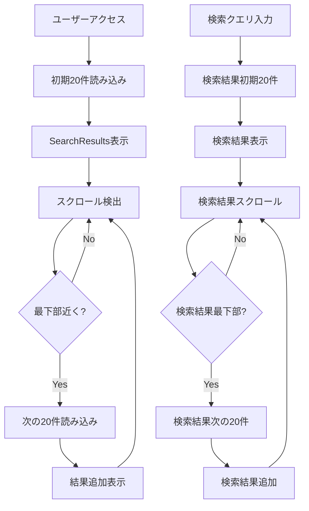

# 設計書

## 概要

スペルトナエル検索サイトに無限スクロール機能を実装し、初期読み込み時間を短縮してユーザー体験を向上させます。現在の一括データ読み込み方式から、段階的なデータ読み込み方式に変更し、パフォーマンスとスケーラビリティを改善します。

## アーキテクチャ

### 現在のアーキテクチャの問題点

1. **一括データ読み込み**: `getAllSpells()`で全スペル（約50KB、数百件）を一度に読み込み
2. **フロントエンド処理負荷**: 全データをメモリに保持し、フィルタリングを実行
3. **初期表示遅延**: サイト訪問時に全データ読み込み完了まで待機

### 新しいアーキテクチャ



## コンポーネントと インターフェース

### 1. APIエンドポイントの拡張

#### 既存: `/api/spells`
- **現在**: 全スペルを返す
- **変更後**: ページネーション対応

```typescript
// 新しいクエリパラメータ
interface SpellsAPIParams {
  q?: string;        // 検索クエリ（既存）
  page?: number;     // ページ番号（新規）
  limit?: number;    // 1ページあたりの件数（新規）
  offset?: number;   // オフセット（新規）
}

// 新しいレスポンス形式
interface SpellsAPIResponse {
  spells: SpellData[];
  pagination: {
    currentPage: number;
    totalPages: number;
    totalCount: number;
    hasNextPage: boolean;
    hasPreviousPage: boolean;
  };
}
```

### 2. カスタムフック: `useInfiniteScroll`

```typescript
interface UseInfiniteScrollOptions {
  initialData?: SpellData[];
  pageSize?: number;
  searchQuery?: string;
  enabled?: boolean;
}

interface UseInfiniteScrollReturn {
  data: SpellData[];
  isLoading: boolean;
  isLoadingMore: boolean;
  error: string | null;
  hasNextPage: boolean;
  loadMore: () => void;
  refresh: () => void;
  reset: () => void;
}
```

### 3. コンポーネント拡張

#### `SearchResults`コンポーネント
- 無限スクロール対応
- ローディング状態表示
- エラーハンドリング

#### `InfiniteScrollTrigger`コンポーネント（新規）
- スクロール位置検出
- 自動読み込みトリガー
- Intersection Observer API使用

### 4. データ管理の改善

#### `data-utils.ts`の拡張
```typescript
// 新しい関数
export async function getSpellsPaginated(
  page: number = 1,
  limit: number = 20,
  searchQuery?: string
): Promise<{
  spells: SpellCast[];
  pagination: PaginationInfo;
}>;

export async function getSpellsCount(searchQuery?: string): Promise<number>;
```

## データモデル

### 新しい型定義

```typescript
// ページネーション情報
export interface PaginationInfo {
  currentPage: number;
  totalPages: number;
  totalCount: number;
  hasNextPage: boolean;
  hasPreviousPage: boolean;
  pageSize: number;
}

// 無限スクロール状態
export interface InfiniteScrollState {
  data: SpellData[];
  currentPage: number;
  isLoading: boolean;
  isLoadingMore: boolean;
  hasNextPage: boolean;
  error: string | null;
  searchQuery: string;
}

// スクロール設定
export interface ScrollConfig {
  pageSize: number;
  triggerOffset: number; // 最下部からの距離（px）
  debounceMs: number;     // デバウンス時間
  maxRetries: number;     // 再試行回数
}
```

## エラーハンドリング

### エラーの種類と対応

1. **ネットワークエラー**
   - 自動再試行（最大3回）
   - ユーザーへの通知
   - 手動再試行ボタン

2. **データ形式エラー**
   - ログ記録
   - フォールバック表示
   - エラー報告機能

3. **パフォーマンスエラー**
   - 読み込み時間監視
   - タイムアウト処理
   - 段階的劣化

### エラー状態の管理

```typescript
interface ErrorState {
  type: 'network' | 'data' | 'timeout' | 'unknown';
  message: string;
  retryCount: number;
  timestamp: Date;
  canRetry: boolean;
}
```

## テスト戦略

### 1. ユニットテスト
- `useInfiniteScroll`フックのテスト
- ページネーション関数のテスト
- エラーハンドリングのテスト

### 2. 統合テスト
- APIエンドポイントのテスト
- コンポーネント間の連携テスト
- 検索機能との統合テスト

### 3. E2Eテスト
- 無限スクロールの動作テスト
- モバイルデバイスでのテスト
- パフォーマンステスト

### 4. パフォーマンステスト
- 初期読み込み時間の測定
- メモリ使用量の監視
- スクロール性能の測定

## パフォーマンス最適化

### 1. メモリ管理
- 仮想化による DOM 要素の削減
- 不要なデータのクリーンアップ
- メモリリークの防止

### 2. ネットワーク最適化
- リクエストのデバウンス
- 並列リクエストの制限
- キャッシュ戦略の実装

### 3. レンダリング最適化
- React.memo の活用
- useMemo/useCallback の適切な使用
- 仮想スクロールの検討

## アクセシビリティ対応

### 1. スクリーンリーダー対応
- aria-live リージョンでの状態通知
- 読み込み状態の適切なアナウンス
- キーボードナビゲーション対応

### 2. 視覚的インジケーター
- ローディングスピナー
- プログレスバー
- 完了状態の表示

### 3. 操作性の向上
- 「トップに戻る」ボタン
- 手動読み込みオプション
- スキップリンクの提供

## セキュリティ考慮事項

### 1. レート制限
- API呼び出し頻度の制限
- 異常なリクエストの検出
- DDoS攻撃の防止

### 2. データ検証
- 入力値のサニタイゼーション
- レスポンスデータの検証
- XSS攻撃の防止

### 3. プライバシー保護
- 検索履歴の適切な管理
- 個人情報の最小化
- GDPR準拠の考慮

## 実装フェーズ

### フェーズ1: 基盤実装
- APIエンドポイントの拡張
- 基本的な無限スクロール機能
- エラーハンドリングの実装

### フェーズ2: 機能拡張
- 検索機能との統合
- パフォーマンス最適化
- アクセシビリティ対応

### フェーズ3: 品質向上
- テストの充実
- モニタリング機能
- ユーザーフィードバック対応

## 監視とメトリクス

### 1. パフォーマンスメトリクス
- 初期読み込み時間
- 追加読み込み時間
- メモリ使用量
- スクロール性能

### 2. ユーザー体験メトリクス
- 離脱率の変化
- 検索成功率
- エラー発生率
- ユーザー満足度

### 3. 技術メトリクス
- API応答時間
- エラー率
- キャッシュヒット率
- リソース使用量
